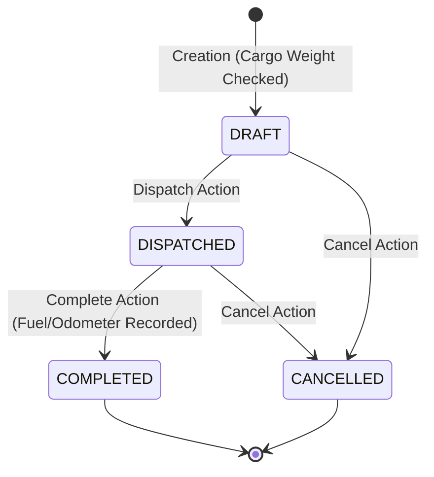
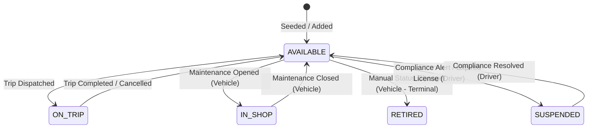

# TransitOps — Smart Transport Operations Platform
=================================================

TransitOps is a production-grade, state-of-the-art **Smart Transport Operations Platform** designed for orchestrating commercial vehicle logistics, driver compliance, active trip scheduling, live operational cost metrics, and return on investment (ROI) analytics in real time. 

Localized for the Indian market, the platform maps routes across major transport hubs and integrates commercial vehicle categories from top national manufacturers.

---

## 🏗️ Architectural Overview

TransitOps uses a strict monorepo architecture with a shared layer that enforces validation and types across both frontend and backend systems, eliminating code drift and ensuring type safety at all interface boundaries.

```mermaid
graph TD
  subgraph Frontend (React + TS)
    Vite[Vite Dev Server / Router]
    Components[Reusable UI Components]
    Forms[React Hook Form + ZodResolver]
    State[TanStack Query v5 State Cache]
  end

  subgraph Shared (Types & Schemas)
    Schemas[Shared Zod Validation Schemas]
    Const[Shared Constants & States Matrix]
  end

  subgraph Backend (Express + TS)
    Middleware[Auth & RBAC Middleware]
    Controllers[Route Controllers]
    StateEngine[Centralized State Engine]
    CalcService[Centralized Calculation Service]
  end

  subgraph Database Layer
    Prisma[Prisma ORM Client]
    SQLite[SQLite File dev.db]
  end

  Forms -->|Validates schemas| Schemas
  Controllers -->|Validates requests| Schemas
  StateEngine -->|Matrix validation| Const
  StateEngine -->|Atomic operations| Prisma
  CalcService -->|Aggregates cost & ROI| Prisma
  Prisma --> SQLite
```

---

## 🔒 Security & Role-Based Access Control (RBAC)

The system features robust server-side RBAC and strict frontend scoping:
- **Fleet Manager (Sunita Sharma)**: Full master CRUD, dispatch oversight, and comprehensive reports.
- **Driver (Rajesh Kumar)**: Restricted to viewing own assigned active trips and initiating self-dispatch/completion. **Completely blocked** from viewing master databases, operational reports, maintenance logs, or other drivers' data.
- **Safety Officer (Vikram Singh)**: Specialized view/edit permissions limited to driver compliance fields (license expiration, safety scores). Cannot dispatch trips or modify vehicles.
- **Financial Analyst (Priya Patel)**: Read-only operations view, full access to fuel logs and expenses, and cost/ROI reports.

### 🛡️ Field-Level RBAC & Driver Scoping
- **Field-level Zod schemas** reject payloads on driver updates if a Safety Officer tries to touch non-compliance fields.
- **Dynamic API scoping** forces a `where.driverId = profileId` check on trips if the authenticated user's role is `DRIVER`, ensuring drivers can never query or view other drivers' trips.

---

## 🔄 State Machine Lifecycle & Business Logic

All transitions in vehicle, driver, and trip states are funneled through a centralized transaction-safe state service (`statusTransition.ts`).

### 📦 Trip Lifecycle Transition Matrix



### 🚛 Vehicle & Driver Availability Lifecycle



- **Atomic Dispatch Checks**: Wrapped inside a database `$transaction`, a dispatch action verifies:
  1. Trip status is `DRAFT`.
  2. Vehicle and Driver statuses are both `AVAILABLE`.
  3. Driver's commercial license is valid and not expired.
  4. Cargo weight $\le$ vehicle's maximum carrying capacity.
  - If all checks pass, the trip flips to `DISPATCHED`, and both vehicle and driver are atomically locked to `ON_TRIP`.

---

## 📊 Live Computed Metrics (No Caching)

Every metric shown on the dashboard and reports is computed live from the raw ledger to prevent database state drift:

- **Fleet Utilization Rate**:
  $$\text{Utilization (\%)} = \left( \frac{\text{Vehicles with status } \textit{ON\_TRIP}}{\text{Total active non-retired vehicles}} \right) \times 100$$
- **Vehicle Fuel Efficiency**:
  $$\text{Efficiency (km/L)} = \frac{\text{Sum of distance run on completed trips}}{\text{Sum of fuel consumed}}$$
- **Operational Cost Rollup**:
  $$\text{Total Cost (₹)} = \text{Sum of fuel purchase costs} + \text{Sum of closed maintenance costs}$$
- **Return on Investment (ROI)**:
  $$\text{ROI (\%)} = \left( \frac{\text{Quoted revenue from completed trips} - \text{Total Cost}}{\text{Vehicle acquisition cost}} \right) \times 100$$

---

## 🎨 Design System & Visual Guidelines
The visual theme is custom-crafted to look premium, modern, and operational while strictly avoiding default styling packages:
- **Warm Off-White (`#F7F5F0`)** for background surfaces, reducing eye strain.
- **Forest Green (`#2C5F2D`)** and **Terracotta (`#B5502D`)** for primary and status accents.
- **Curated typography**: Outfit/DM Serif Display for headings, clean high-readability sans for tabular data.
- **Compliance Warning Colors**: Color-coded warnings flag driver licenses expiring in $<30$ days (amber) and expired licenses (brick red).

---

## 🚀 Getting Started & Local Setup

### 📋 Prerequisites
- Node.js (v18+)
- npm (v9+)

### ⚙️ Installation
1. Clone the repository and install dependencies:
   ```bash
   npm install
   ```
2. Set up the local SQLite database and pre-seed operational data:
   ```bash
   npm run setup
   ```
   *(This pushes the schema, generates the Prisma client, and seeds users, vehicles, drivers, trips, fuel records, and expenses.)*

3. Launch both the Express server and Vite frontend concurrently:
   ```bash
   npm run dev
   ```
   - **Frontend UI**: [http://localhost:5173/](http://localhost:5173/)
   - **Backend API**: [http://localhost:3001/](http://localhost:3001/)

---

## 🔑 Pre-Seeded Indian Logins (Password: `password123`)

| Role | Email Account | Name (Seed) | Scoping / Access Level |
|---|---|---|---|
| **Fleet Manager** | `fleet@transitops.com` | Sunita Sharma | Full CRUD, Operations oversight, Reports |
| **Driver** | `rajesh.k@transitops.com` | Rajesh Kumar | View own trips, self-dispatch/complete |
| **Safety Officer** | `safety@transitops.com` | Vikram Singh | Edit driver compliance, view reports |
| **Financial Analyst** | `finance@transitops.com` | Priya Patel | Edit fuel/expenses, view cost/ROI reports |

---

## 🧪 Automated E2E Smoke Validation
The platform includes an automated end-to-end integration test (`smoke_test.ts`) verifying the state machine rules:
```bash
npx tsx C:\Users\hp\.gemini\antigravity\brain\0bc546fc-be3f-4bf5-9519-0f5acdbd9ecc\scratch\smoke_test.ts
```
The test verifies:
- Registering a new vehicle (`Van-05`) and driver (`Alex`).
- Scheduling and dispatching a 450kg trip (within 500kg capacity) $\rightarrow$ checks atomic status lock.
- Completing the trip $\rightarrow$ checks odometer sync and release of resources.
- Opening maintenance $\rightarrow$ checks vehicle sets to `IN_SHOP` and disappears from dispatch selection.
- Verifying live ROI calculation in Reports.
- Checking rule safety: blocks $550\text{kg}$ cargo; blocks double-booking of active driver.
